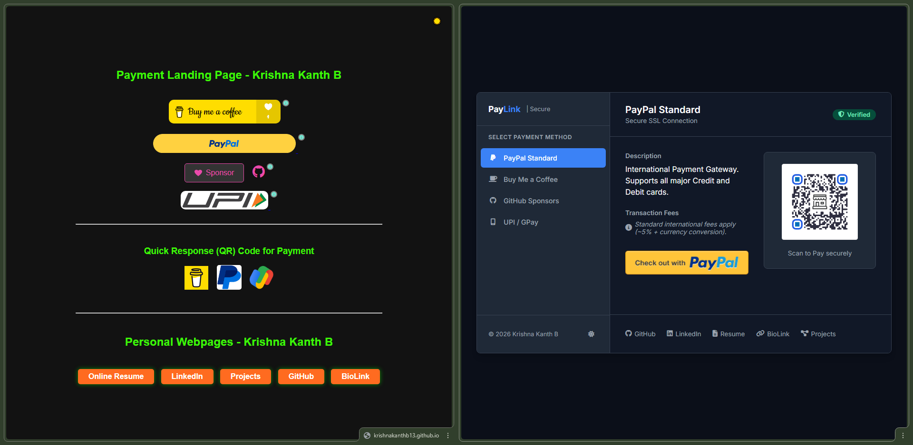

# PayLink | Secure Checkout

A premium, responsive, and minimalist secure checkout page designed for unified payment collection. This project provides a centralized hub for various payment methods, including international gateways and local Indian UPI options.



## 🎯 What is it?

**PayLink** is a static web-based "Secure Checkout" system. It allows users to choose from multiple payment methods through a clean, corporate-style interface inspired by modern fintech platforms like Razorpay and Stripe.

### Supported Payment Methods
- **PayPal Standard**: International payment gateway supporting all major credit/debit cards.
- **Buy Me a Coffee**: A simple way for supporters to contribute small donations.
- **GitHub Sponsors**: Direct sponsorship for open-source contributions with zero platform fees.
- **UPI / GPay**: Instant bank-to-bank transfers (optimized for India) with integrated QR codes and identity copying.

## ✨ Key Features

- **Corporate UI/UX**: Clean "Inter" typography with a professional color palette.
- **Dynamic Theme support**: Built-in Dark Mode and Light Mode with system preference detection.
- **Interactive Tabs**: Smooth switching between payment providers without page reloads.
- **Mobile Optimized**: Fully responsive grid layout that adapts to any screen size.
- **Copy-to-Clipboard**: One-click copying for UPI IDs to ensure accuracy.
- **Secure by Design**: Verified badges and SSL-focused messaging to build trust.

## 📂 Project Structure

```text
/S
├── .github/
│   ├── FUNDING.yml         # GitHub Sponsorship configuration
│   └── FUNDING_example.yml # Template for funding platforms
├── assets/                 # (Assumed parent directory for site assets)
├── PLP.html                # Main Secure Checkout entry point
├── PLP-old.html            # Legacy version
└── *.png                   # QR codes and branding assets
```

## 🚀 How to Use

1. **Deploy**: Since this is a static HTML project, you can host it anywhere (GitHub Pages, Vercel, Netlify).
2. **Customize**: 
   - Open `PLP.html`.
   - Update the IDs and links in the specific `tab-content` divs (lines 564-688).
   - Update the footer links (lines 691-702) with your personal profiles.
3. **QR Codes**: Replace the `.png` files in the root directory with your own generated payment QR codes.

## 🤝 Support & Funding

If you find this project useful, you can support my work via:

- **GitHub Sponsors**: [@krishnakanthb13](https://github.com/sponsors/krishnakanthb13)
- **Buy Me a Coffee**: [krishnakanthb](https://www.buymeacoffee.com/krishnakanthb)
- **PayPal**: [krishnakanthb13](https://www.paypal.com/paypalme/krishnakanthb13)

## 🔗 Internal Links

- [Official Website](https://krishnakanthb13.github.io/)
- [LinkedIn Profile](https://www.linkedin.com/in/bkrishnakanth/)
- [Project Portfolio](https://sites.google.com/view/krishnakanthb/about)
- [BioLink](https://bio.site/krishnakanthb13)

---
© 2026 Krishna Kanth B
