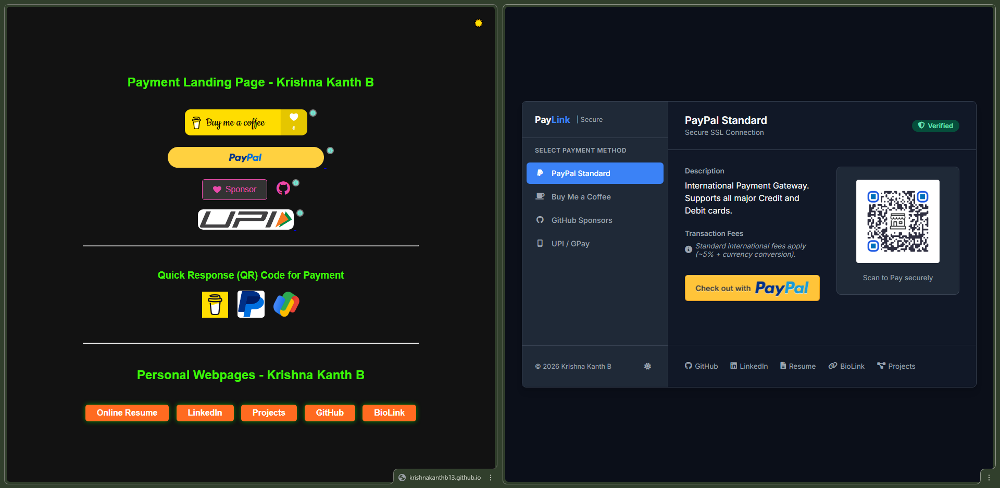

# PayLink | Secure Checkout

A premium, responsive, and minimalist secure checkout page designed for unified payment collection. This project provides a centralized hub for various payment methods, including international gateways and local Indian UPI options.



## 🎯 What is it?

**PayLink** is a static web-based "Secure Checkout" system. It allows users to choose from multiple payment methods through a clean, corporate-style interface inspired by modern fintech platforms like Razorpay and Stripe.

There are two checkout experiences — one tuned for **desktop / large screens** and one for **mobile** — fronted by a responsive **launcher** (`index.html`) that recommends the right one for the visitor's device. Both lead to the same payment options.

### Supported Payment Methods
- **PayPal Standard**: International payment gateway supporting all major credit/debit cards.
- **Buy Me a Coffee**: A simple way for supporters to contribute small donations.
- **GitHub Sponsors**: Direct sponsorship for open-source contributions with zero platform fees.
- **UPI / GPay**: Instant bank-to-bank transfers (optimized for India) with integrated QR codes and identity copying.

## ✨ Key Features

- **Responsive launcher**: `index.html` detects the visitor's screen/pointer and highlights the recommended checkout (without forcing a redirect, so shared links always open the launcher).
- **Corporate UI/UX**: Clean "Inter" typography with a professional color palette.
- **Dynamic theme support**: Built-in Dark Mode and Light Mode with system-preference detection, shared across all pages via a single `theme` key.
- **Interactive Tabs**: Smooth switching between payment providers without page reloads.
- **Mobile Optimized**: Fully responsive layout that adapts to any screen size.
- **Copy-to-Clipboard**: One-click copying for the UPI ID to ensure accuracy.
- **Secure by Design**: Verified badges and SSL-focused messaging to build trust.

## 📂 Project Structure

```text
/S
├── index.html              # Responsive launcher → links to both checkouts (entry point)
├── PLP.html                # Secure Checkout — Desktop / large screens
├── PLPm.html               # Secure Checkout — Mobile
├── README.md
├── assets/                 # Images used by the live pages (renamed, self-contained)
│   ├── paypal-qr.png       # PayPal QR  (was Sponsor-Krishn-qrcode.png)
│   ├── bmc-qr.png          # Buy Me a Coffee QR  (was bmc_qr.png)
│   ├── upi-qr.png          # UPI / GPay QR  (was gpay.png)
│   └── preview.png         # README preview image  (was overhaul.png)
├── legacy/                 # Frozen relic — kept untouched, self-contained
│   ├── PLP-old.html        # Original v1 payment page
│   └── *.png               # All images the relic references (original names)
└── .github/
    ├── FUNDING.yml         # GitHub Sponsorship configuration
    ├── FUNDING_example.yml # Template for funding platforms
    └── README.md
```

> Site-wide assets (fonts, favicons, etc.) live in the repository's root `assets/` folder; the checkout pages reference the favicon at `../assets/images/`.

## 🚀 How to Use

1. **Deploy**: This is a static project — host it anywhere (GitHub Pages, Vercel, Netlify). On GitHub Pages it is served at `/S/` (the launcher).
2. **Customize**:
   - Open `PLP.html` / `PLPm.html`.
   - Update the IDs and links inside each `tab-content` block (PayPal, Buy Me a Coffee, GitHub, UPI).
   - Update the footer links with your own profiles.
3. **QR Codes**: Replace the `.png` files in `assets/` with your own generated payment QR codes (keep the same file names, or update the `` references to match).

## 🤝 Support & Funding

If you find this project useful, you can support my work via:

- **GitHub Sponsors**: [@krishnakanthb13](https://github.com/sponsors/krishnakanthb13)
- **Buy Me a Coffee**: [krishnakanthb](https://www.buymeacoffee.com/krishnakanthb)
- **PayPal**: [krishnakanthb13](https://www.paypal.com/paypalme/krishnakanthb13)

## 🔗 Internal Links

- [Official Website](https://krishnakanthb13.github.io/)
- [LinkedIn Profile](https://www.linkedin.com/in/bkrishnakanth/)
- [Project Portfolio](https://sites.google.com/view/krishnakanthb/about)
- [BioLink](https://bio.site/krishnakanthb13)

---

## Content Sync Report: PLP.html vs PLPm.html

| Element | PLP.html | PLPm.html | Status |
|---|---|---|---|
| **Tab labels** | PayPal Standard, Buy Me a Coffee, GitHub Sponsors, UPI / GPay | Same | ✅ |
| **Header title (dynamic)** | PayPal Standard / UPI / GPay / PhonePe / Buy Me A Coffee / GitHub Sponsorship | Same | ✅ |
| **PayPal description** | International Payment Gateway. Supports all major Credit and Debit cards. | Same | ✅ |
| **PayPal fee note** | Standard international fees apply (~5% + currency conversion). | Same | ✅ |
| **PayPal button link** | `paypal.com/paypalme/krishnakanthb13` | Same | ✅ |
| **PayPal QR image** | `assets/paypal-qr.png` | Same | ✅ |
| **BMC description** | Support my work with a small donation. Great for one-time support. | Same | ✅ |
| **BMC fee note** | 5% platform fee + standard payment processing fees. | Same | ✅ |
| **BMC button link** | `buymeacoffee.com/krishnakanthb` | Same | ✅ |
| **BMC QR image** | `assets/bmc-qr.png` | Same | ✅ |
| **GitHub description** | Sponsor my open source contributions. Monthly or one-time tiers available. | Same | ✅ |
| **GitHub fee notes** | Zero fees / Up to 6% for orgs | Same | ✅ |
| **GitHub Sponsors link** | `github.com/sponsors/krishnakanthb13` | Same | ✅ |
| **UPI description** | Instant bank-to-bank transfer using any UPI app (GPay, PhonePe, Paytm). | Same | ✅ |
| **UPI availability notes** | Free / India Only (Best on Mobile) | Same | ✅ |
| **UPI ID** | `krishnakanthb13@okhdfcbank` | Same | ✅ |
| **UPI deep link** | `upi://pay?pa=krishnakanthb13@okhdfcbank&pn=Krishna` | Same | ✅ |
| **UPI / GPay QR image** | `assets/upi-qr.png` | Same | ✅ |
| **Secure badge** | 🛡 Verified / Secure SSL Connection | Same | ✅ |
| **Footer links (5)** | GitHub, LinkedIn, Resume, BioLink, Projects | Same | ✅ |
| **Copyright** | © 2026 Krishna Kanth B | Same | ✅ |

---

© 2026 Krishna Kanth B
